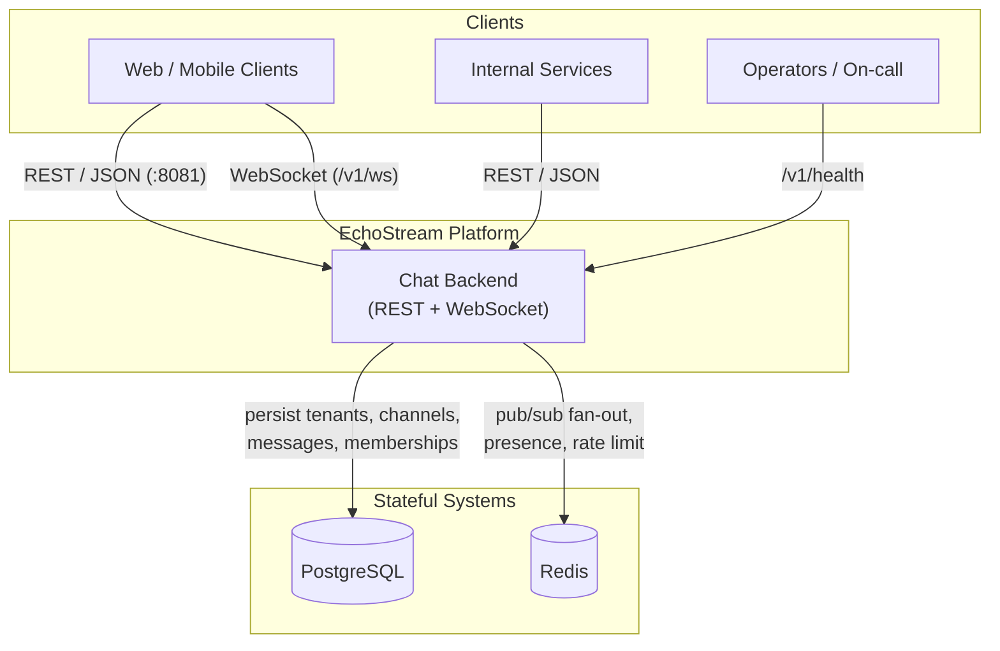
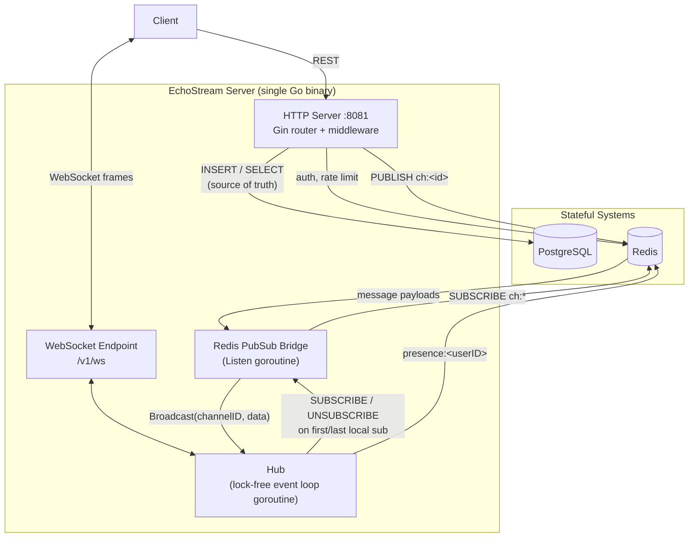
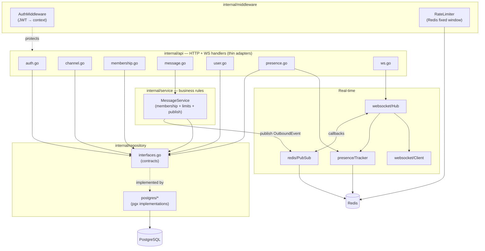
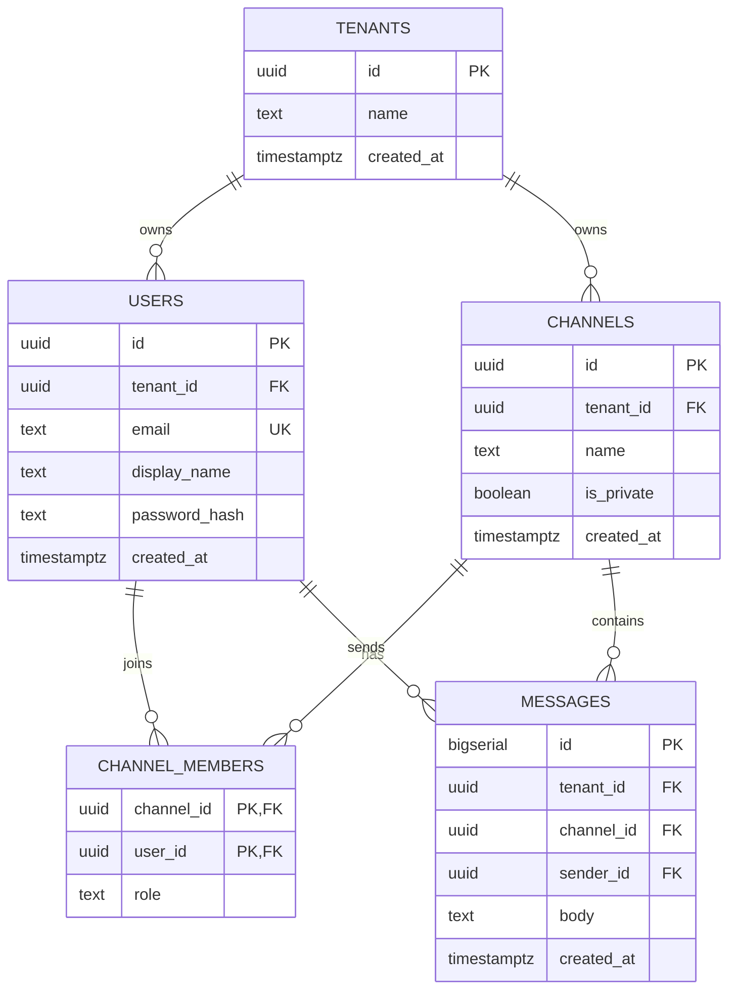
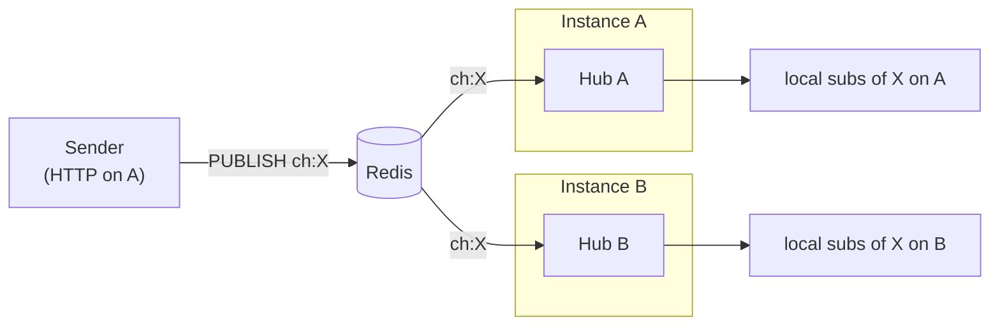
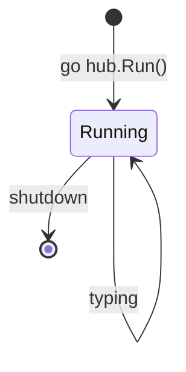
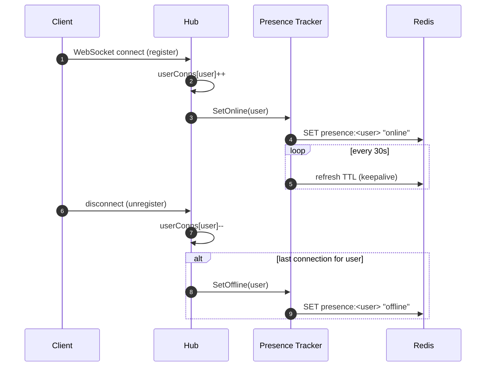

# EchoStream — Architecture Deep Dive

> A multi-tenant, real-time **chat backend** written in Go — the API layer behind a Slack-style
> product. Tenants, users, channels, memberships, and messages are persisted in PostgreSQL; live
> delivery, presence, and typing indicators are fanned out over **WebSockets**, coordinated across
> horizontally-scaled instances by **Redis pub/sub**.

This document is the canonical system-design reference. It is written as an **onboarding and design
guide** — every major decision includes the *why* and the *tradeoff*, not just the *what*. If you are
here to understand how to grow this into a full SDE2 portfolio project, jump to
[§14 Roadmap](#14-roadmap--what-to-build-next).

---

## Table of Contents

1. [System at a Glance](#1-system-at-a-glance)
2. [C4 Level 1 — System Context](#2-c4-level-1--system-context)
3. [C4 Level 2 — Container View](#3-c4-level-2--container-view)
4. [C4 Level 3 — Internal Components](#4-c4-level-3--internal-components)
5. [Data Model (ERD)](#5-data-model-erd)
6. [Layered Request Lifecycle — Send a Message](#6-layered-request-lifecycle--send-a-message)
7. [Real-Time Delivery — WebSockets + Redis Fan-out](#7-real-time-delivery--websockets--redis-fan-out)
8. [The Hub Event Loop](#8-the-hub-event-loop)
9. [Presence & Typing](#9-presence--typing)
10. [Cross-Cutting Concerns](#10-cross-cutting-concerns)
11. [Scaling & Capacity Planning](#11-scaling--capacity-planning)
12. [Failure Modes & Mitigations](#12-failure-modes--mitigations)
13. [Key Design Decisions & Tradeoffs](#13-key-design-decisions--tradeoffs)
14. [Roadmap — What to Build Next](#14-roadmap--what-to-build-next)
15. [Design Principles Summary](#15-design-principles-summary)

---

## 1. System at a Glance

EchoStream solves one problem well: **"accept, persist, and deliver chat messages in real time for
thousands of independent tenants, while scaling horizontally without a single-instance bottleneck."**

| Concern | How EchoStream handles it |
|---|---|
| **Durability** | Every message is written to PostgreSQL *before* the sender is acknowledged. The DB is the single source of truth; real-time delivery is a best-effort layer on top. |
| **Tenant isolation** | Every entity carries a `tenant_id`; JWT claims carry `(user_id, tenant_id, email)`; every query is tenant-scoped. |
| **Real-time delivery** | WebSocket connections are held by a lock-free **Hub**. New messages are `PUBLISH`ed to Redis and fanned out to all instances that hold subscribers for that channel. |
| **Horizontal scaling** | Redis pub/sub decouples message producers from the WebSocket connections. A message sent to an instance in `us-east-1a` reaches a subscriber connected to an instance in `us-east-1b`. No sticky sessions required for delivery correctness. |
| **Presence** | Redis keys (`presence:<userID>`) with a keepalive heartbeat; a user goes offline only when their **last** connection drops. |
| **Fair usage** | Per-user fixed-window rate limiting in Redis; fails open on Redis outage. |
| **Ordering & pagination** | Messages use a monotonic `bigserial` ID for cheap ordering and cursor pagination. |
| **Graceful shutdown** | SIGINT/SIGTERM drains in-flight HTTP requests, then tears down pubsub → hub → redis → postgres → logger in order. |

**Tech stack:** Go 1.25 · Gin (HTTP) · Gorilla WebSocket · PostgreSQL (pgx) · Redis (go-redis/v9) ·
JWT (golang-jwt/v5) · zap · Docker Compose.

---

## 2. C4 Level 1 — System Context

Who talks to EchoStream, and what does EchoStream talk to?



**Design note:** REST is the request/response front door (auth, channel CRUD, message history).
The WebSocket endpoint is the *live* channel — clients open one connection and subscribe to the
channels they care about. Both transports share the same persistence and business logic.

---

## 3. C4 Level 2 — Container View

The API server and the WebSocket hub run **in the same Go binary today** (the hub is a goroutine),
but the design keeps them decoupled through Redis so they can be split later.



**Key insight (Redis as the horizontal-scaling backbone):** the HTTP handler that receives a message
does **not** need to hold the recipients' WebSocket connections. It writes to Postgres, then
`PUBLISH`es to `ch:<channelID>`. Every server instance that has at least one local subscriber to that
channel has an active Redis `SUBSCRIBE`, receives the payload, and fans it out to its local sockets.
This is the classic **pub/sub fan-out** pattern that lets any instance accept a write and every
instance deliver it.

---

## 4. C4 Level 3 — Internal Components

The Go packages and how they depend on each other. Arrows point in the direction of the dependency.



**The golden rule of the layering:** business logic lives in **services**, never in handlers.
`MessageHandler` parses the request, calls `MessageService.Send()`, and formats the response. The
service is where membership is checked, body length is validated, the row is persisted, and the
real-time event is published. Repositories are dumb data access behind interfaces — which makes the
services unit-testable with mocks.

```
HTTP Handler  →  Service  →  Repository Interface  →  Postgres impl
 (parse/format)  (rules)      (contract)              (SQL)
```

---

## 5. Data Model (ERD)



**Modeling notes & tradeoffs:**

- **`tenant_id` is the top-level isolation boundary.** It is denormalized onto `messages` (migration
  `003`) so message queries can filter by tenant without joining through `channels` — a deliberate
  read-performance-over-normalization tradeoff on the hottest table.
- **`messages.id` is `bigserial` (int64), not UUID.** Monotonic integers are cheaper to index and
  give a natural total order for cursor pagination (`WHERE id < before ORDER BY id DESC`). UUIDs would
  force ordering by `created_at`, which is not guaranteed unique.
- **`channel_members` is a composite-key join table.** `PRIMARY KEY (channel_id, user_id)` prevents
  duplicate memberships for free and doubles as the lookup index for the membership check on every
  send.
- **`is_private` on channels** gates access: public channels are joinable by any tenant member;
  private channels require an invite (enforced in the service/handler layer, not the schema).

---

## 6. Layered Request Lifecycle — Send a Message

`POST /v1/channels/:id/messages` — the canonical write path that touches every layer.

```mermaid
sequenceDiagram
    autonumber
    participant C as Client
    participant MW as Auth + RateLimit
    participant H as MessageHandler
    participant S as MessageService
    participant DB as Postgres
    participant R as Redis
    participant Hubs as All Server Hubs
    participant Subs as Subscribed Clients

    C->>MW: POST /v1/channels/:id/messages (JWT)
    MW->>MW: verify JWT → inject (user_id, tenant_id)
    MW->>MW: INCR rl:<user>:<bucket> (fail-open)
    MW->>H: forward request
    H->>S: Send(tenant, channel, sender, body)
    S->>S: validate body (non-empty, ≤ 4000 bytes)
    S->>DB: IsMember(channel, sender)?
    DB-->>S: true
    S->>DB: INSERT message → id, created_at
    DB-->>S: persisted message
    S->>R: PUBLISH ch:<channelID> {OutboundEvent}
    Note over S,R: publish is best-effort;<br/>message is already durable
    S-->>H: message
    H-->>C: 201 Created (message JSON)

    R-->>Hubs: deliver payload to every SUBSCRIBEd instance
    Hubs->>Subs: WebSocket frame {type:"message", ...}
```

**The critical ordering guarantee:** persist **then** publish. The database write is the commit
point. If the Redis `PUBLISH` fails, the message is still saved and the sender still gets a `201`;
the failure is logged, and the message will appear on the next history fetch (`GET .../messages`).
We never acknowledge a message we haven't durably stored, and we never lose a message because the
real-time layer hiccupped.

---

## 7. Real-Time Delivery — WebSockets + Redis Fan-out

A single WebSocket connection multiplexes many channel subscriptions. The client speaks a small JSON
protocol over the socket:

| Direction | Type | Payload |
|---|---|---|
| client → server | `subscribe` | `{ "type": "subscribe", "channel_id": "<uuid>" }` |
| client → server | `unsubscribe` | `{ "type": "unsubscribe", "channel_id": "<uuid>" }` |
| client → server | `typing` | `{ "type": "typing", "channel_id": "<uuid>" }` |
| server → client | `subscribed` / `unsubscribed` | ack of the above |
| server → client | `message` | `{ "type": "message", "channel_id": "...", "message": {...} }` |
| server → client | `typing` | broadcast to *other* subscribers |
| server → client | `presence_change` | `{ "type": "presence_change", "user_id": "...", "status": "online\|offline" }` |
| server → client | `error` | `{ "type": "error", "error": "..." }` |

**Why Redis pub/sub and not in-memory only?** With a single instance you could fan out messages
directly from the hub. The moment you run two instances behind a load balancer, a sender on instance
A and a listener on instance B live in different process memory. Redis pub/sub is the shared bus that
reconnects them:



**Subscription lifecycle optimization:** an instance only holds a Redis `SUBSCRIBE` for channels it
currently has local subscribers for. The hub fires `onChannelActive` when the *first* local client
subscribes to a channel (→ `PubSub.Subscribe`) and `onChannelInactive` when the *last* one leaves
(→ `PubSub.Unsubscribe`). This keeps each instance's Redis subscription set proportional to its
actual live interest, not the global channel count.

---

## 8. The Hub Event Loop

The `Hub` (`internal/websocket/hub.go`) is the heart of the real-time layer and a deliberate exercise
in **lock-free concurrency**. All mutable state — which clients are in which channels, connection
counts per user, keepalive cancels — is owned by a **single goroutine** (`Hub.Run()`). Every mutation
arrives as a message on a channel; nothing is touched from the outside.



**Why no mutexes?** The hub multiplexes over Go channels in a `select`:

```go
for {
    select {
    case c := <-h.register:      // add connection, bump userConns, start keepalive
    case c := <-h.unregister:    // remove from all channels, stop keepalive, maybe offline
    case s := <-h.subscribeCh:   // add to channel; if first → onChannelActive
    case s := <-h.unsubscribeCh: // remove; if last → onChannelInactive
    case m := <-h.broadcastCh:   // fan out payload to a channel's local clients
    case e := <-h.typingCh:      // fan out typing to everyone *except* the sender
    case <-h.shutdown:           // exit
    }
}
```

Because only `Run()` reads or writes the maps, there is no data race and no lock contention — the
event loop is the serialization point. Producers (HTTP handlers, the Redis listener, per-connection
read pumps) simply send on the appropriate channel and move on.

**Per-connection plumbing** (`internal/websocket/client.go`): each `Client` has a buffered `send`
channel and a write pump goroutine. `Client.Send(data)` is a non-blocking enqueue — if a slow client
fills its buffer, the hub drops rather than blocking the whole event loop (backpressure isolation).

---

## 9. Presence & Typing

**Presence** (`internal/presence/tracker.go` + Redis):



The key invariant: **a user is online if they have ≥1 live connection.** The hub tracks
`userConns map[uuid.UUID]int`; presence only flips to offline when that count hits zero. This
correctly handles the multi-device / multi-tab case — closing one tab does not mark you offline while
another is still open.

**Typing indicators** are intentionally *ephemeral and un-persisted*. A `typing` frame is fanned out
to the channel's other subscribers and never touches Postgres — typing is a transient UI hint, not
domain data. It is broadcast to `client.userID != sender`, so you never see your own typing echoed
back.

---

## 10. Cross-Cutting Concerns

### Authentication & Multi-Tenancy

- **JWT** (`internal/auth`) carries `(user_id, tenant_id, email)`. `middleware.AuthMiddleware`
  verifies the signature and injects claims into the Gin context.
- Handlers read identity via `middleware.GetUserID(c)` / `GetTenantID(c)` / `GetEmail(c)` — they
  never trust client-supplied tenant/user IDs from the body.
- Every repository method takes `tenantID` for query scoping, so tenant isolation is enforced at the
  data-access layer even where foreign keys already imply it.

### Rate Limiting (`internal/middleware/ratelimit.go`)

- Fixed-window counter: key `rl:<userID>:<unix_time / window>`, atomic `INCR`, TTL = window.
- Current policy: **60 requests / minute / authenticated user**.
- **Fails open**: if Redis is unavailable, requests pass through. Availability is prioritized over
  strict enforcement for a chat product.
- *Tradeoff:* fixed windows allow a 2× burst at a boundary. A sliding-window log (Redis sorted set)
  would be smoother — noted in the roadmap.

### Graceful Shutdown (`cmd/server/main.go`)

On SIGINT/SIGTERM:
1. `http.Server.Shutdown()` stops accepting new connections; in-flight requests get 5s to finish.
2. Deferred teardown runs in dependency order: **pubsub → hub → redis → postgres → logger**.

### Observability

- Structured logging via **zap** (`internal/observ`), environment-aware (dev vs prod encoders).
- `GET /v1/health` liveness endpoint.
- *Gap:* no metrics/tracing yet — see roadmap.

---

## 11. Scaling & Capacity Planning

EchoStream is designed to scale **horizontally on stateless server instances** behind a load
balancer, with Redis and Postgres as the shared state tier.

| Dimension | Bottleneck | Scaling lever |
|---|---|---|
| **HTTP throughput** | CPU on API instances | Add instances; they are stateless for REST. |
| **WebSocket fan-out** | Open FDs / memory per instance | Add instances; connections spread by the LB. Delivery correctness is instance-independent thanks to Redis. |
| **Message writes** | Postgres write IOPS | Connection pooling (pgxpool); later: partition `messages` by `tenant_id` or by time. |
| **Message history reads** | Index scans on hot channels | `(channel_id, id)` cursor index; later: read replicas / cache recent messages in Redis. |
| **Redis pub/sub** | Fan-out CPU on a single Redis | Redis Cluster / sharded pub/sub keyed by channel; or a dedicated broker (NATS/Kafka) for very high fan-out. |

**Back-of-envelope:** with fixed-window limits at 60 req/min/user, 10k concurrent active users
generate ≈ 10k writes/min ≈ 167 writes/s — comfortable for a single Postgres primary. WebSocket
fan-out is the earlier scaling concern: a viral channel with 50k subscribers turns one write into 50k
socket frames, spread across however many instances hold those connections.

**Stickiness:** the LB does *not* need sticky sessions for correctness (Redis reconnects producers
and consumers). Sticky routing only helps keep a client's REST calls and its WebSocket on the same
box, which is a minor locality optimization, not a requirement.

---

## 12. Failure Modes & Mitigations

| Failure | Impact | Mitigation |
|---|---|---|
| **Redis down** | No real-time fan-out, no rate limiting, presence stale. | Messages still persist and return `201`; rate limiter **fails open**; clients recover missed messages via history fetch. Real-time is explicitly best-effort. |
| **Postgres down** | Writes and history reads fail. | Requests return `5xx`; this is a hard dependency (source of truth). Mitigate with HA Postgres / failover. |
| **Slow WebSocket client** | Could stall delivery. | Per-client buffered `send` channel; non-blocking enqueue drops for a slow client rather than blocking the hub. |
| **Instance crash** | Its WebSocket connections drop. | Clients reconnect (to any instance), re-subscribe, and fetch missed history. No server-side session state is lost that matters. |
| **PUBLISH after persist fails** | Subscribers miss the live push. | Logged; message is durable and appears on next history load. |
| **JWT secret rotation** | All active tokens invalidated. | Documented operational consequence; plan rotation windows. |
| **Rate-limit boundary burst** | Brief 2× over-limit. | Accepted tradeoff of fixed window; sliding window on roadmap. |

---

## 13. Key Design Decisions & Tradeoffs

| Decision | Why | Tradeoff / Cost |
|---|---|---|
| **Service layer holds all business rules** | Handlers stay thin and testable; rules live in one place. | More packages/indirection than putting logic in handlers. |
| **Repository interfaces + Postgres impl** | Swappable data layer; services unit-testable with mocks. | Boilerplate per entity. |
| **Persist-then-publish** | Durability first; real-time is additive. | A publish failure means a client relies on history fetch for that message. |
| **Redis pub/sub for fan-out** | Simple, horizontal scaling without sticky sessions. | Redis pub/sub is fire-and-forget (no replay); a subscriber offline during a publish misses the live event (recovered via history). |
| **Lock-free single-goroutine Hub** | No mutexes, no data races, easy to reason about. | All events serialize through one goroutine; extreme fan-out may need sharded hubs. |
| **`bigserial` message IDs** | Cheap ordering + cursor pagination. | Sequential IDs leak volume; not globally unique across shards (fine for single primary). |
| **Denormalized `tenant_id` on messages** | Fast tenant-scoped reads without joins. | Slight write redundancy; must stay consistent with channel's tenant. |
| **Rate limiter fails open** | Availability > strictness for chat. | A Redis outage temporarily disables limiting. |

---

## 14. Roadmap — What to Build Next

EchoStream today is a **solid real-time core**: auth, tenancy, channels, memberships, durable
messages, WebSocket delivery, presence, typing, rate limiting, and graceful shutdown. To make it a
*serious* SDE2 portfolio project, the following extensions each teach a distinct
backend/system-design competency. They are ordered to build on one another.

### Phase 1 — Product depth (message semantics)
- **Message edits & deletes** (`PATCH`/`DELETE .../messages/:mid`) with `edited_at` / soft-delete
  columns, and `message_updated` / `message_deleted` WebSocket events. *Teaches:* mutation events,
  event versioning.
- **Reactions** (emoji) via a `message_reactions` table + `reaction_added/removed` events. *Teaches:*
  high-cardinality writes, aggregation.
- **Read receipts / unread counts** — per-user `last_read_message_id` per channel. *Teaches:*
  per-user cursor state, counting at scale.
- **Threaded replies** — self-referential `parent_message_id`. *Teaches:* hierarchical data modeling.

### Phase 2 — Reliability & correctness
- **Idempotency keys** on message send (Redis, Stripe-style) to dedupe client retries. *Teaches:*
  exactly-once semantics at the edge.
- **Reliable delivery / catch-up** — replace best-effort fan-out gaps with a per-connection
  "since message_id" resync on (re)subscribe. *Teaches:* at-least-once delivery, gap recovery.
- **Sliding-window rate limiter** (Redis sorted sets) replacing the fixed window. *Teaches:* the
  classic rate-limiter design-interview progression.
- **Outbox for cross-service events** if you add downstream consumers (search indexer, notifications).
  *Teaches:* transactional outbox, the pattern Nimbus is built around.

### Phase 3 — Search & scale
- **Full-text message search** (Postgres `tsvector`, then Elasticsearch/OpenSearch). *Teaches:*
  search indexing, dual-write consistency.
- **Message partitioning** by time or tenant; **read replicas** for history. *Teaches:* sharding &
  read/write splitting.
- **Redis Cluster / sharded pub/sub** or a broker (NATS/Kafka) for fan-out at high subscriber counts.
  *Teaches:* messaging backbones beyond a single Redis.

### Phase 4 — Platform & operations
- **gRPC transport** for internal service-to-service calls (mirror Nimbus's dual-transport design).
  *Teaches:* Protobuf contracts, streaming.
- **Observability**: Prometheus metrics (connection counts, publish latency, delivery lag), OpenTelemetry
  tracing, `/metrics` endpoint. *Teaches:* production observability.
- **Automated DB migrations** in code (golang-migrate) instead of the init-script auto-apply.
- **Infrastructure as Code** (Terraform: ECS/Fargate or EKS, RDS, ElastiCache) + Dockerfile + CI.
  *Teaches:* deployment topology, the same IaC muscle Nimbus demonstrates.
- **Test coverage & load tests** — grow the table-driven unit tests, add integration tests
  (testcontainers) and a WebSocket load test (k6). *Teaches:* verification at scale.

> Suggested first slice: **Phase 1 message edits/deletes + Phase 2 idempotency + Phase 4 metrics.**
> Together they round out the write path, make it correct under retries, and make it observable —
> the three things an SDE2 reviewer looks for first.

---

## 15. Design Principles Summary

1. **The database is the source of truth.** Everything real-time is a best-effort layer on top;
   nothing is acknowledged before it is durable.
2. **Business logic lives in services.** Handlers parse and format; repositories do SQL; services
   decide.
3. **Tenant isolation is enforced at the query layer**, not just implied by foreign keys.
4. **Real-time state is owned by one goroutine.** The lock-free Hub is the serialization point — no
   mutexes, no races.
5. **Redis decouples producers from connections.** Any instance can accept a write; every instance
   can deliver it. No sticky sessions required for correctness.
6. **Degrade gracefully.** Redis outages disable real-time and rate limiting but never lose messages;
   the rate limiter fails open.
7. **Shut down cleanly.** Drain HTTP, then tear down dependencies in order.
```
